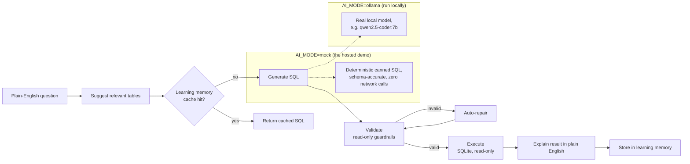

# AI SQL Studio — Local-First AI Workbench

A privacy-first SQL workbench that turns plain-English questions into SQL. Ask a
question, watch it get planned, generated, validated, auto-repaired if needed,
executed read-only, and explained — all with a real seeded analytics database
and zero required cloud API keys.

[](https://github.com/vvvaibhaverma-123459876/AI-first-SQL-workbench/actions/workflows/ci-and-deploy.yml)


### 🚀 Live demo (mock AI)

> **Set this once the Render/Railway service exists:** replace this line with
> `**[Live demo](https://<your-deploy-url>)**` — see the "Deploy" section below
> for the one-time hosting setup; the URL isn't known until then, so it can't be
> hardcoded in advance.

The hosted demo runs `AI_MODE=mock` — a deterministic, schema-aware assistant
with **zero API keys and zero network calls**, not a limitation of the real
thing. It answers the 5 suggested demo queries below (and similar questions)
with real, validated, executable SQL against the seeded database. For actual
free-form natural-language-to-SQL generation, run it locally with Ollama (see
["Run with real local AI"](#run-with-real-local-ai-ollama) below).

## Screenshot

<!--
  Drop a short screen recording of the AI panel here before sharing this repo
  externally. Suggested capture: type one of the 5 suggested demo queries,
  click Ask, and let the plan -> SQL -> result -> explanation flow play out.
  Save it as assets/demo.gif (create the assets/ folder) and it will render
  below.
-->
<!--  -->

## Architecture



FastAPI serves both `/api/*` and the built React SPA from one process/port —
see `Dockerfile`.

---

## Quick start

```bash
git clone https://github.com/vvvaibhaverma-123459876/AI-first-SQL-workbench.git
cd AI-first-SQL-workbench
./start.sh
```

Open **http://localhost:8000**, create an account, and create a workspace —
the v2 rebuild in progress (see `docs/` and the build plan) adds real
accounts and workspaces ahead of everything else. From the empty workspace
shell, **Open legacy demo workbench** still gives you the original
single-user SQL demo against the bundled sample database while the
workspace-native file/connection experience is being built out phase by
phase.

`start.sh` handles everything automatically:
- creates the Python virtual environment
- installs backend dependencies
- detects your installed Ollama model
- builds the React frontend
- seeds the demo analytics database
- starts the server (a local SQLite file backs the new accounts/workspaces
  control plane by default — see `docker-compose.yml` for the full
  Postgres/Redis/Ollama self-hosted stack)

> **Requires:** Python 3.11+, Node.js 18+, [Ollama](https://ollama.com) with any model installed (`mistral:7b`, `qwen2.5-coder:7b`, `llama3`, etc.)

---

## What it does

Type a question in plain English. The assistant:

1. Suggests relevant tables from the schema
2. Checks local memory for a cached answer
3. Generates SQL using your local Ollama model
4. Validates and auto-repairs the SQL if needed
5. Executes safely (read-only guardrails)
6. Explains the result in plain English
7. Suggests follow-up analyses
8. Stores the successful run locally for faster future queries

Everything happens locally. The only network call is to `localhost:11434` (Ollama).

---

## Features

### AI assistant
- **Ask + Run** — natural language → SQL → result → explanation in one click
- **Generate Only** — generate SQL without executing
- **Explain** — get a plain-English explanation of any SQL
- **Fix** — auto-repair broken SQL using the local model
- **Suggest Tables** — identify relevant tables for a question

### Editor
- Monaco editor with SQL syntax highlighting
- Multi-tab query workspace
- `⌘↵` to run SQL
- Inline save with named queries
- One-click table/column insertion from schema browser

### Results
- Paginated data table with sticky headers
- **Automatic bar chart** for numeric result sets
- Clickable follow-up questions from the assistant
- Export to CSV
- Cache-hit indicator (repeated queries return instantly)

### Schema browser
- Collapsible table list with column types and PK/FK indicators
- Table preview as a mini data grid
- Full-text search across tables and columns

### Learning memory
- Successful queries stored locally
- Reused on similar future questions (before calling Ollama)
- Thumbs-up/down feedback adjusts confidence
- Use count tracked — common patterns get faster over time

---

## Run with real local AI (Ollama)

The hosted demo above runs in mock mode by design — it needs a real local model
process to talk to, which a public container can't provide. Running it yourself
with Ollama unlocks actual free-form natural-language-to-SQL generation:

```bash
# Install Ollama: https://ollama.com
ollama pull qwen2.5-coder:7b  # recommended for SQL generation
# or: ollama pull mistral:7b
# or: ollama pull llama3
```

`start.sh` auto-detects whichever model you have installed. To override, set it
explicitly (`backend/.env` for local runs, or the `AI_MODE`/`OLLAMA_MODEL` env
vars for Docker):

```env
AI_MODE=ollama
OLLAMA_MODEL=qwen2.5-coder:7b
```

If Ollama is not reachable — not installed, not running, or `AI_MODE=mock` —
the app automatically falls back to the deterministic mock provider so the
workbench stays usable either way; see `app/llm/providers.py`.

---

## Demo database

The app ships with a pre-seeded SQLite analytics database containing:

| Table | ~Rows | Description |
|---|---|---|
| `users` | 900 | Users with country, signup date, marketing channel |
| `transactions` | 17,800 | Transactions with amount, merchant, status |
| `cards` | 700 | Card assignments per user |
| `referrals` | 300 | Referral source and conversion data |
| `support_tickets` | 650 | Open/waiting/resolved tickets with category |
| `onboarding_events` | 4,450 | Step-by-step onboarding funnel |

Exact live counts are always available at `GET /api/health` (`db_row_counts`).

### Suggested demo queries

Try these in the AI prompt — all 5 are verified (see
`backend/tests/test_api.py::test_suggested_demo_questions_produce_distinct_valid_results`)
to return distinct, valid, non-empty results even in `AI_MODE=mock`:

- *Top 20 users by total transaction amount*
- *Which referral channel has the best card activation rate?*
- *Monthly revenue trend for the last 6 months*
- *Users with open support tickets and their total spend*
- *Average days to first transaction by country*

---

## Project layout

```
AI-first-SQL-workbench/
├── start.sh                      ← single-command startup
├── backend/
│   └── app/
│       ├── api/                  ← FastAPI routes + Pydantic schemas
│       ├── assistant/            ← end-to-end orchestration pipeline
│       ├── core/                 ← settings, config
│       ├── db/                   ← demo seed data, metadata init
│       ├── llm/                  ← Ollama, mock, optional HuggingFace
│       ├── models/               ← SQLAlchemy metadata models
│       ├── services/             ← AI, execution, cache, schema, validation
│       └── utils/
├── frontend/
│   └── src/
│       ├── components/           ← Sidebar, EditorPanel, ResultsPanel, AIPanel
│       ├── services/             ← axios API client
│       ├── store/                ← Zustand global state
│       └── types/
├── Dockerfile
├── docker-compose.yml
└── Makefile
```

**Runtime flow:**

```
Browser → FastAPI (:8000)
            ├── /api/*   → Python services → SQLite / Ollama
            └── /*       → React SPA (served as static files)
```

No separate frontend server in production — FastAPI serves everything.

---

## Manual setup (alternative to start.sh)

```bash
# Backend
cd backend
python3 -m venv .venv && source .venv/bin/activate
pip install -r requirements.txt
cp .env.example .env          # edit OLLAMA_MODEL if needed
python -m app.db.seed_demo_data

# Frontend
cd ../frontend
npm install
npm run build                 # builds into frontend/dist/

# Start
cd ../backend
uvicorn app.main:app --host 0.0.0.0 --port 8000
```

### Dev mode (hot reload)

```bash
npm install           # root — installs concurrently
npm run dev           # starts FastAPI + Vite dev server simultaneously
```

Frontend at `http://localhost:5173`, backend at `http://localhost:8000`.

---

## Docker

```bash
docker compose up --build
```

Open `http://localhost:8000`. Expects Ollama on the host at:

```env
OLLAMA_BASE_URL=http://host.docker.internal:11434
```

The production image (used for the hosted demo) instead defaults to
`AI_MODE=mock` and binds to `$PORT` — see `Dockerfile`.

---

## Deploy

**main auto-deploys once hosting is configured.**
`.github/workflows/ci-and-deploy.yml` runs backend pytest, frontend build+test,
and a Docker build on every push/PR; on push to `main` (after tests pass) it
triggers a deploy and polls `$DEPLOY_URL/api/health` until it's live.
`.github/workflows/health-check.yml` also pings the live URL daily and opens a
GitHub issue if it's down. See [CONTRIBUTING.md](CONTRIBUTING.md) — PRs must be
green before merge since merging to `main` is a live deploy.

### One-time setup

**Option A — Render** (matches the CI deploy job as written):
1. Render → New → Web Service → this repo. Render builds `Dockerfile` directly.
2. Settings → Deploy Hook → copy the URL → add it as GitHub secret
   `RENDER_DEPLOY_HOOK`.
3. Once you have the service's public URL, add it as GitHub repo variable
   `DEPLOY_URL` (Settings → Secrets and variables → Actions → Variables) — both
   `ci-and-deploy.yml`'s post-deploy check and the daily health check need it.
4. Leave `AI_MODE` unset (the image already defaults to `mock`) unless you want
   to point the hosted instance at a real Ollama endpoint you control.

**Option B — Railway** (native GitHub integration, no GH Actions deploy step):
1. Railway → New Project → Deploy from GitHub repo → this repository. Railway
   detects and builds the `Dockerfile`.
2. Generate a public domain, then set the `DEPLOY_URL` repo variable to it (for
   the CI post-deploy check and daily health check — Railway itself doesn't
   need this variable, only this repo's workflows do).
3. `RENDER_DEPLOY_HOOK` / the `deploy` job's Render step is simply unused in
   this path — Railway redeploys `main` on its own.

No database or external service is required for either option — `db_row_counts`
in `/api/health` will show the seeded SQLite demo data as soon as the container
boots.

---

## API reference

```
GET  /api/health
GET  /api/ai/status
GET  /api/schema
GET  /api/tables/{name}/preview

POST /api/generate-sql
POST /api/validate-sql
POST /api/execute-sql
POST /api/execute-sql/export
POST /api/explain-sql
POST /api/repair-sql
POST /api/suggest-tables

POST /api/assistant/run
GET  /api/assistant/memory
POST /api/assistant/feedback

GET  /api/history
GET  /api/saved-queries
POST /api/saved-queries
DELETE /api/saved-queries/{id}
```

---

## Configuration

All options in `backend/.env`:

```env
AI_MODE=ollama                      # ollama | mock — takes precedence over AI_PROVIDER when set;
                                     # the production Dockerfile sets AI_MODE=mock
AI_PROVIDER=ollama                  # ollama | mock | hf — used when AI_MODE is unset (back-compat)
OLLAMA_BASE_URL=http://localhost:11434
OLLAMA_MODEL=mistral:7b

DEFAULT_ROW_LIMIT=200
RESULT_CACHE_TTL_SECONDS=900        # cache TTL for repeated queries
ASSISTANT_CACHE_MIN_SCORE=0.74      # similarity threshold for memory hits
MAX_REPAIR_ATTEMPTS=2
SQL_EXECUTION_TIMEOUT_SECONDS=30
```

---

## Tech stack

| Layer | Technology |
|---|---|
| Frontend | React 18, TypeScript, Vite, Tailwind CSS, Zustand, Monaco Editor |
| Backend | Python, FastAPI, SQLAlchemy, Pydantic, sqlglot |
| AI runtime | Ollama (local) with mock fallback |
| Database | SQLite (demo) — extensible to Postgres, DuckDB |
| Dev tooling | concurrently, pytest, vitest |
